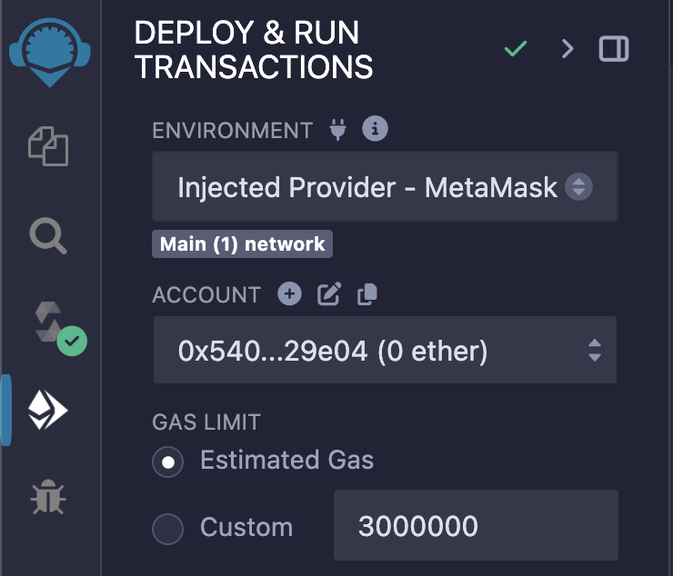

# Interact with EVM smart contracts

This is a simple dApp to show how one can trigger smart contract functions on an EVM base layer from a Cartesi rollup. In this example, our application logic resides on two layers - the EVM base layer and the Cartesi execution layer.

- **On base layer** - We deploy a simple `contracts/Storage.sol` smart contract on our local Anvil node and try to hit its `store()` function. This dApp logic is  further extended by deploying `contracts/SimpleERC721.sol` contract to trigger `mint()` function.
- **On Cartesi execution layer** - With the logic inside `src/index.js`, you can set the address of the previously deployed smart contracts and parse input JSON to check user input for either storing a number or minting an NFT.

## Running the backend
Pre-requisite: Cartesi CLI and Docker desktop

**Build the Cartesi backend**
```
cartesi build
```
**Run the backend node**
```
cartesi run --epoch-duration 30
```
**Deploy solidity smart contracts**

You can choose a method of your choice to compile and deploy the contracts inside `./contracts` directory. We'll use Remix IDE here. 
- Open [Remix](https://remix.ethereum.org/) online and create a new workspace.
- Copy `Storage.sol` from `./contracts` and paste in contracts folder on your Remix workspace.
- Compile the contract using `Ctrl+S`
- Before deploying, make sure you have local Anvil network added to Metamask and few accounts imported for testing. You can follow the answer [here](https://ethereum.stackexchange.com/questions/164536/how-can-i-add-anvil-token-from-the-test-token-provided-to-my-metamask-account) to set this up. 

- To deploy - Connect the `Injected Provider - Metamask` in Environment and select an imported account as a deployer. Hit deploy.



- Save address of the deployed contract to use later.
- You can follow the same steps to deploy the NFT contract or any other custom solidity smart contract.

## Sending inputs to the Cartesi backend
To send inputs we can use below command on a separate terminal tab. 
```
cartesi send generic
``` 
When prompted for an input JSON string, refer the following samples.

To relay the address of your deployed smart contracts:
```
{"method": "set_address", "address": "your-contract-address-here"}
```

Create voucher to generate a number to store on base layer:
```
{"method": "generate_number", "number": "7"}
```

Create voucher mint an NFT:
```
{"method": "mint_nft"}
```

## Executing vouchers
This step finally triggers the base layer functions. Open below url in your browser.
```
http://localhost:8080/explorer
```   
Look for the `voucher` created against your latest inputs in the local rollups explorer. In the explorer, every voucher gives you an execute button to trigger the desired on-chain action.

## Reading base layer
You can use cast command in terminal to read the updated value on Storage contract.
```
cast call <deployed-contract-address-here> "retrieve()(uint256)" 0xf39fd6e51aad88f6f4ce6ab8827279cfffb92266 --mnemonic "test test test test test test test test test test test junk" --mnemonic-index 0 --rpc-url "http://localhost:8545"
```
If everything went well, above command will give you twice the number you sent as an input. That's all for this tutorial. Bye! 